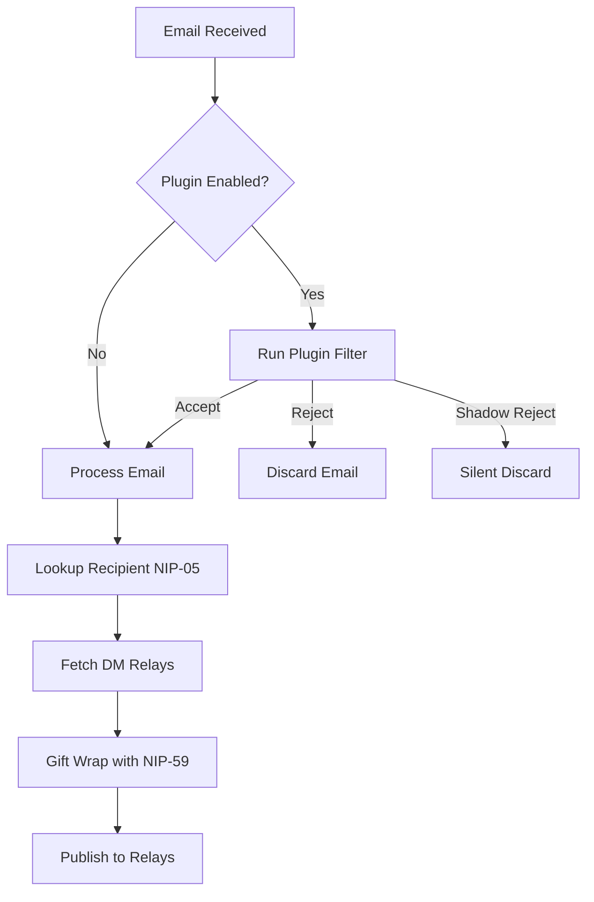

# Inbound Service

The inbound service receives emails from legacy systems and publishes them to Nostr.

---

## Architecture

```
┌─────────────┐      ┌─────────────────┐      ┌────────┐
│ Legacy Email│ ───► │ Inbound Service │ ───► │ Relays │
└─────────────┘      └─────────────────┘      └────────┘
```

---

## Modules

| Module | Description |
|--------|-------------|
| `core/` | Shared logic: NIP-59 wrapping, plugin runner, NIP-05 lookup |
| `smtp/` | SMTP server for receiving emails directly |
| `mailgun/` | Mailgun webhook handler |

---

## SMTP Mode

Runs a local SMTP server to receive emails directly.

### Setup

```bash
cd bridge-inbound/smtp
npm install
cp .env.example .env
npm run build
sudo npm start  # Port 25 requires root
```

### Configuration

```bash
INBOUND_PRIVATE_KEY=<hex>
RELAYS=wss://relay.damus.io,wss://nos.lol
SMTP_PORT=25
SMTP_HOST=0.0.0.0
PLUGIN_PATH=/path/to/plugin  # Optional
```

### How It Works

1. Email arrives at SMTP server
2. Service extracts recipient from `To:` header
3. Looks up recipient's npub via NIP-05
4. Fetches recipient's DM relays (kind 10050)
5. Gift-wraps the email content (NIP-59)
6. Publishes to recipient's relays

---

## Mailgun Mode

Receives emails via Mailgun webhooks.

### Setup

```bash
cd bridge-inbound/mailgun
npm install
cp .env.example .env
npm run build
npm start
```

### Configuration

```bash
INBOUND_PRIVATE_KEY=<hex>
MAILGUN_WEBHOOK_SECRET=xxx
RELAYS=wss://relay.damus.io,wss://nos.lol
HTTP_PORT=3001
PLUGIN_PATH=/path/to/plugin  # Optional
```

### Mailgun Configuration

1. Set up a route in Mailgun to forward to your webhook
2. Configure the webhook URL: `https://your-server.com/webhook`
3. Set up signature validation with `MAILGUN_WEBHOOK_SECRET`

---

## Processing Flow



---

## Recipient Resolution

The service resolves recipients using NIP-05:

| Format | Resolution |
|--------|------------|
| `alice@bridge.com` | Query NIP-05 for `alice@bridge.com` |
| `npub1...@bridge.com` | Extract npub directly from address |
| `npub1...@nostr` | Extract npub directly from address |

---

## Security

!!!warning Authentication
The SMTP server does not authenticate senders. For production use, consider:
- Running behind a trusted mail relay
- Using Mailgun mode with webhook signature validation
- Implementing IP whitelisting
!!!
