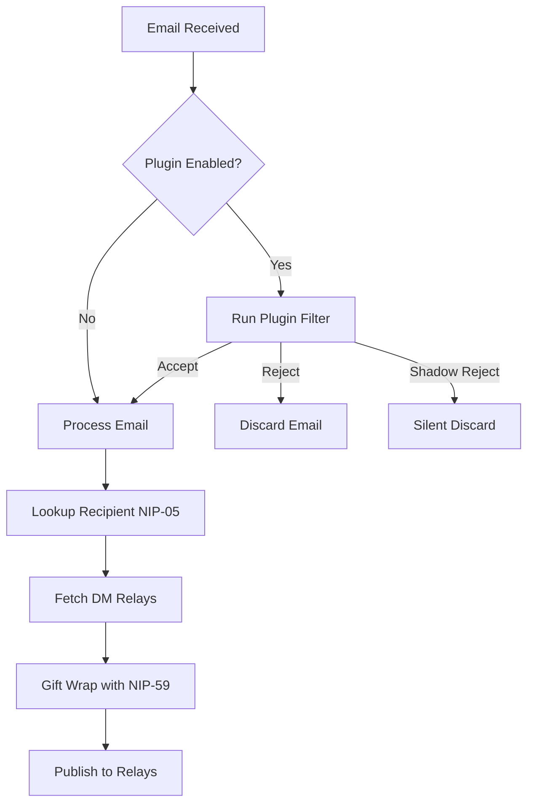

# Inbound Service

The inbound service receives emails from legacy systems and publishes them to Nostr.

---

## Architecture

```
┌─────────────┐      ┌─────────────────┐      ┌────────┐
│ Legacy Email│ ───► │ Inbound Service │ ───► │ Relays │
└─────────────┘      └─────────────────┘      └────────┘
```

---

## Modules

| Module | Description |
|--------|-------------|
| `core/` | Shared logic: NIP-59 wrapping, plugin runner, NIP-05 lookup |
| `smtp/` | SMTP server for receiving emails directly |
| `mailgun/` | Mailgun webhook handler |

---

## SMTP Mode

Runs a local SMTP server to receive emails directly.

### Setup

```bash
cd bridge-inbound/smtp
npm install
cp .env.example .env
npm run build
sudo npm start  # Port 25 requires root
```

### Configuration

```bash
INBOUND_PRIVATE_KEY=<hex>
RELAYS=wss://relay.damus.io,wss://nos.lol
SMTP_PORT=25
SMTP_HOST=0.0.0.0
PLUGIN_PATH=/path/to/plugin  # Optional
```

### How It Works

1. Email arrives at SMTP server
2. Service takes the recipients from the SMTP envelope
3. Looks up each recipient's pubkey via NIP-05
4. Fetches the recipient's DM relays (kind 10050)
5. Builds the kind 1301 rumor, setting `mail-from` to the legacy sender
6. Gift-wraps it (NIP-59) and publishes to the recipient's relays

The `mail-from` tag is what lets the recipient's client tell a bridged email
from a native one. There is no `rcpt-to` inbound: the recipient is already the
`p` tag of the wrap.

---

## Mailgun Mode

Receives emails via Mailgun webhooks.

### Setup

```bash
cd bridge-inbound/mailgun
npm install
cp .env.example .env
npm run build
npm start
```

### Configuration

```bash
INBOUND_PRIVATE_KEY=<hex>
MAILGUN_WEBHOOK_SECRET=xxx
RELAYS=wss://relay.damus.io,wss://nos.lol
HTTP_PORT=3001
PLUGIN_PATH=/path/to/plugin  # Optional
```

### Mailgun Configuration

1. Set up a route in Mailgun to forward to your webhook
2. Configure the webhook URL: `https://your-server.com/webhook`
3. Set up signature validation with `MAILGUN_WEBHOOK_SECRET`

---

## Processing Flow


```mermaid
flowchart TD
    A[Email Received] --> B{Plugin Enabled?}
    B -->|Yes| C[Run Plugin Filter]
    B -->|No| D[Process Email]
    C -->|Accept| D
    C -->|Reject| E[Discard Email]
    C -->|Shadow Reject| F[Silent Discard]
    D --> G[Lookup Recipient NIP-05]
    G --> H[Fetch DM Relays]
    H --> I[Gift Wrap with NIP-59]
    I --> J[Publish to Relays]
```

---

## Recipient Resolution

The service resolves recipients using NIP-05:

| Format | Resolution |
|--------|------------|
| `alice@bridge.com` | Query NIP-05 for `alice@bridge.com` |
| `npub1...@bridge.com` | Extract npub directly from address |
| `npub1...@nostr` | Extract npub directly from address |

A hex pubkey as the local part works the same way. Take the recipients from the
SMTP envelope rather than the headers: a Bcc recipient is in the envelope and
nowhere else.

---

## Large messages

An email whose MIME does not fit inside a gift wrap is encrypted, uploaded to a
Blossom server and referenced from the kind 1301 event. NIP-44 caps a plaintext
at 65535 bytes and NIP-59 encrypts twice, so the practical inline budget is
well under that. Without this, a bridge can only forward small mail.

---

## User preferences

Read the recipient's public settings (kind 30078, `d = nostr-mail/settings`)
before delivering:

| Field | Effect |
|-------|--------|
| `dm_copy` | Also send a DM copy of the email |
| `prefer_nostr` | This key's NIP-05 addresses want their mail over Nostr |

---

## Security

!!!warning Authentication
The SMTP server does not authenticate senders. For production use, consider:
- Running behind a trusted mail relay
- Using Mailgun mode with webhook signature validation
- Implementing IP whitelisting
!!!
