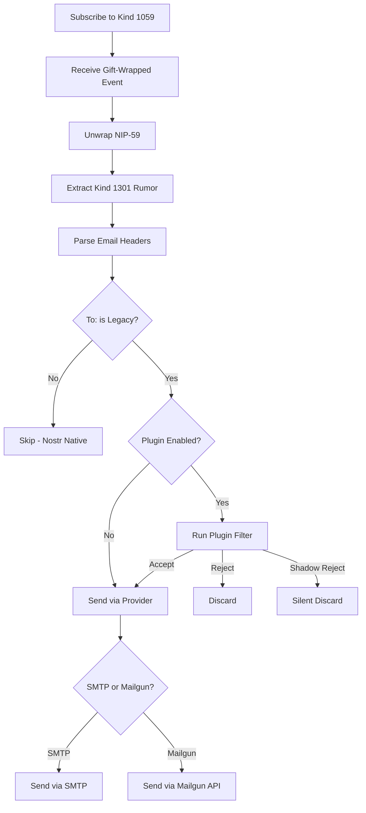

# Outbound Service

The outbound service listens to Nostr events and sends them as legacy emails.

---

## Architecture

```
┌──────┐      ┌────────┐      ┌─────────────────┐      ┌─────────────┐
│ User │ ───► │ Relays │ ───► │ Outbound Service│ ───► │ Legacy Email│
└──────┘      └────────┘      └─────────────────┘      └─────────────┘
```

---

## Setup

```bash
cd bridge-outbound
npm install
cp .env.example .env
npm run build
npm start
```

---

## Configuration

```bash
BRIDGE_PRIVATE_KEY=<hex>
RELAYS=wss://relay.damus.io,wss://nos.lol

# Outbound provider: 'smtp' or 'mailgun'
OUTBOUND_PROVIDER=smtp
FROM_DOMAIN=mail.example.com

# SMTP settings (when OUTBOUND_PROVIDER=smtp)
SMTP_HOST=localhost
SMTP_PORT=25
SMTP_SECURE=false
SMTP_USER=
SMTP_PASS=

# Mailgun settings (when OUTBOUND_PROVIDER=mailgun)
MAILGUN_API_KEY=key-xxx
MAILGUN_DOMAIN=mail.example.com
```

---

## How It Works

1. Service subscribes to gift-wrapped events (kind 1059) for its pubkey
2. When an event arrives, it unwraps the NIP-59 encryption
3. Extracts the email content from the kind 1301 rumor
4. Parses the `To:` header to find the legacy recipient
5. Sends via configured provider (SMTP or Mailgun)

---

## Processing Flow



---

## Email From Address

The bridge determines the From address:

1. **NIP-05 valid**: If the email's `From` is a valid NIP-05 that resolves to `event.pubkey`, it's used as-is
2. **Fallback**: Otherwise, uses `npub@bridge-domain`

```
# If alice@example.com resolves to event.pubkey
From: alice@example.com

# Otherwise, fallback to npub
From: npub1abc123...@yourdomain.com
```

---

## SMTP Provider

For direct SMTP sending:

```bash
OUTBOUND_PROVIDER=smtp
SMTP_HOST=localhost      # Your MTA (Postfix, etc.)
SMTP_PORT=25
SMTP_SECURE=false        # true for TLS
SMTP_USER=               # Optional auth
SMTP_PASS=
```

---

## Mailgun Provider

For Mailgun API sending:

```bash
OUTBOUND_PROVIDER=mailgun
MAILGUN_API_KEY=key-xxx
MAILGUN_DOMAIN=mail.example.com
```

---

## Event Format

The service expects events in this format:

```json
{
  "kind": 1059,
  "pubkey": "<sender>",
  "tags": [
    ["p", "<bridge_pubkey>"]
  ],
  "content": "<encrypted_gift_wrap>"
}
```

After unwrapping, the inner rumor:

```json
{
  "kind": 1301,
  "content": "From: sender@nostr\nTo: recipient@gmail.com\nSubject: Hello\n\nMessage body"
}
```
