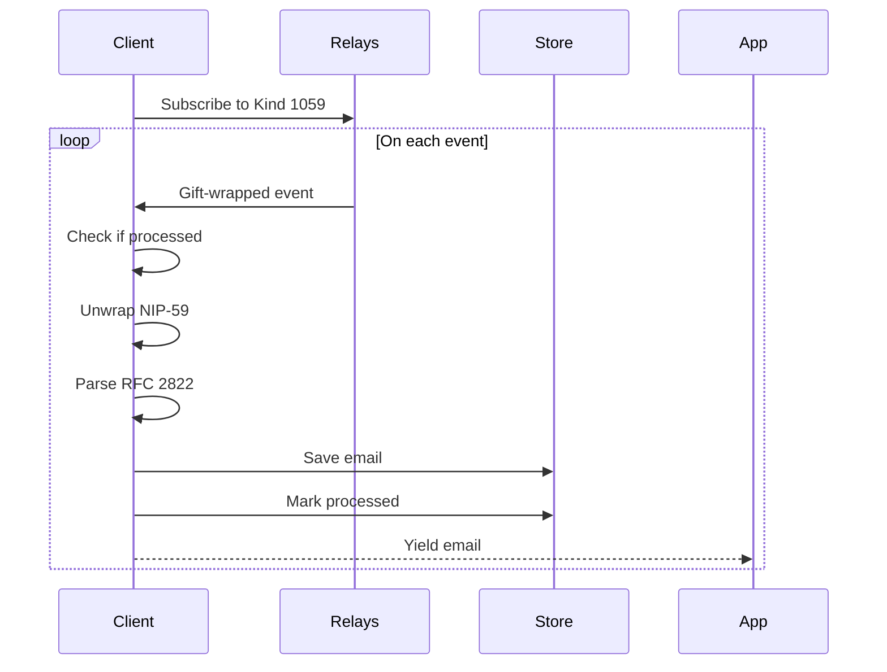

# Receiving Emails

Learn how to receive emails in real-time and sync historical messages.

---

## Real-Time Inbox

Watch for new emails as they arrive:

```dart
await for (final email in client.watchInbox()) {
  print('From: ${email.from}');
  print('Subject: ${email.subject}');
  print('Body: ${email.body}');
}
```

---

## Historical Sync

Fetch and store all historical emails:

```dart
// Sync all emails from relays to local DB
await client.sync();

// Then read from local DB
final emails = await client.getEmails();
```

---

## Combined Approach

Typical usage pattern:

```dart
// 1. Initial sync
await client.sync();

// 2. Get cached emails
final emails = await client.getEmails();
displayEmails(emails);

// 3. Watch for new emails
client.watchInbox().listen((email) {
  displayNewEmail(email);
});
```

---

## Email Model

```dart
class Email {
  final String id;           // Unique event ID
  final String from;         // Sender address
  final String to;           // Recipient address
  final String subject;      // Email subject
  final String body;         // Plain text body
  final DateTime date;       // Email date
  final String senderPubkey; // Nostr pubkey of sender
  final String rawContent;   // Original RFC 2822 content
}
```

---

## Query Emails

### Get All Emails

```dart
final emails = await client.getEmails();
```

### With Pagination

```dart
final emails = await client.getEmails(
  limit: 20,
  offset: 0,
);
```

### Get Single Email

```dart
final email = await client.getEmail('event-id-here');
if (email != null) {
  print(email.body);
}
```

---

## Delete Emails

```dart
await client.delete('event-id-here');
```

---

## How It Works

### Subscription Flow



### Event Processing

1. **Subscribe** to kind 1059 (gift wrap) events tagged with your pubkey
2. **Check** if event was already processed
3. **Unwrap** NIP-59 encryption to get inner event
4. **Verify** inner event is kind 1301 (email)
5. **Parse** RFC 2822 content into Email model
6. **Store** in local database
7. **Yield** to stream listener

---

## Deduplication

The SDK automatically handles duplicates:

```dart
// Events are tracked by ID
if (await _store.isProcessed(event.id)) {
  continue; // Skip already processed
}

// After processing
await _store.markProcessed(event.id);
```

---

## Error Handling

Malformed events are silently skipped:

```dart
try {
  final unwrapped = await _unwrapGiftWrap(event);
  if (unwrapped == null) continue;
  if (unwrapped.kind != 1301) continue;
  // ...
} catch (e) {
  continue; // Skip malformed events
}
```

---

## Flutter Integration

```dart
class InboxController extends GetxController {
  final NostrMailClient _client;
  final emails = <Email>[].obs;
  StreamSubscription? _subscription;

  @override
  void onInit() {
    super.onInit();
    _loadEmails();
    _watchInbox();
  }

  Future<void> _loadEmails() async {
    await _client.sync();
    emails.value = await _client.getEmails();
  }

  void _watchInbox() {
    _subscription = _client.watchInbox().listen((email) {
      emails.insert(0, email);
    });
  }

  @override
  void onClose() {
    _subscription?.cancel();
    super.onClose();
  }
}
```
