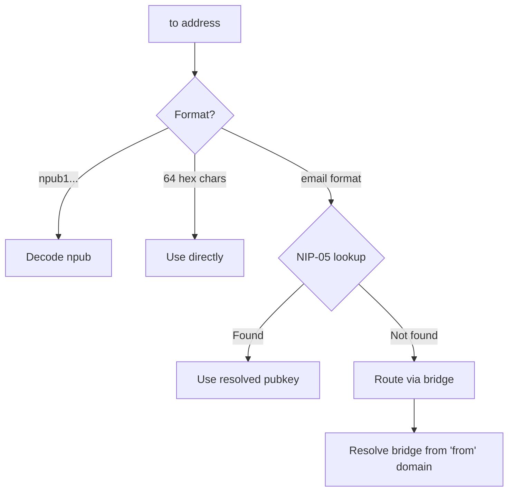

# Sending Emails

Learn how to send emails to both Nostr and legacy email addresses.

---

## Basic Usage

```dart
await client.send(
  to: 'recipient@example.com',
  subject: 'Hello!',
  body: 'This is the email body.',
  from: 'me@mybridge.com',
);
```

---

## Parameters

| Parameter | Type | Required | Description |
|-----------|------|----------|-------------|
| `to` | `String` | Yes | Recipient (npub, hex pubkey, or email) |
| `subject` | `String` | Yes | Email subject |
| `body` | `String` | Yes | Plain text body |
| `from` | `String` | Sometimes | Sender address (required for legacy emails) |
| `htmlBody` | `String?` | No | Optional HTML content |
| `keepCopy` | `bool` | No | Send copy to self (default: true) |

---

## Recipient Formats

The SDK automatically resolves different recipient formats:

### Nostr Native

```dart
// Using npub
await client.send(
  to: 'npub1abc123...',
  subject: 'Hello!',
  body: 'Message',
);

// Using hex pubkey
await client.send(
  to: '0123456789abcdef...',
  subject: 'Hello!',
  body: 'Message',
);
```

### NIP-05 Address

```dart
// Resolves via NIP-05
await client.send(
  to: 'alice@nostr.com',
  subject: 'Hello!',
  body: 'Message',
  from: 'me@mybridge.com',
);
```

### Legacy Email

```dart
// Routes via bridge
await client.send(
  to: 'alice@gmail.com',
  subject: 'Hello!',
  body: 'Message',
  from: 'me@mybridge.com',  // Required!
);
```

---

## Resolution Flow



---

## Rich HTML Emails

```dart
await client.send(
  to: 'recipient@example.com',
  subject: 'Welcome!',
  body: 'Plain text fallback',
  htmlBody: '''
    <html>
      <body>
        <h1>Welcome!</h1>
        <p>This is a <strong>rich</strong> email.</p>
      </body>
    </html>
  ''',
  from: 'me@mybridge.com',
);
```

---

## Keep Copy for Sync

By default, the SDK sends a copy of sent emails to yourself:

```dart
// Copy enabled (default)
await client.send(
  to: 'recipient@example.com',
  subject: 'Hello!',
  body: 'Message',
  from: 'me@mybridge.com',
  keepCopy: true,  // Default
);

// Disable copy
await client.send(
  to: 'recipient@example.com',
  subject: 'Hello!',
  body: 'Message',
  from: 'me@mybridge.com',
  keepCopy: false,
);
```

This allows syncing sent emails across devices.

---

## Bridge Resolution

When sending to a legacy email address, the SDK:

1. Tries NIP-05 resolution first
2. If NIP-05 fails, extracts domain from `from` address
3. Queries `_smtp@domain` for bridge pubkey
4. Sends gift-wrapped email to bridge

```dart
// Sending to alice@gmail.com from me@mybridge.com
// 1. NIP-05 lookup for alice@gmail.com (fails - not Nostr)
// 2. Extract domain from me@mybridge.com -> mybridge.com
// 3. Query _smtp@mybridge.com for bridge pubkey
// 4. Send to bridge, which forwards via SMTP
```

---

## Error Handling

```dart
try {
  await client.send(
    to: 'invalid-address',
    subject: 'Test',
    body: 'Test',
  );
} on RecipientResolutionException catch (e) {
  print('Could not resolve recipient: ${e.address}');
} on NostrMailException catch (e) {
  print('Error: ${e.message}');
}
```

---

## What Happens Under the Hood

1. **Resolve recipient** to Nostr pubkey
2. **Build RFC 2822** email content
3. **Create Kind 1301** email event
4. **Gift wrap** with NIP-59
5. **Publish** to recipient's relays
6. **Send copy** to sender (if enabled)
